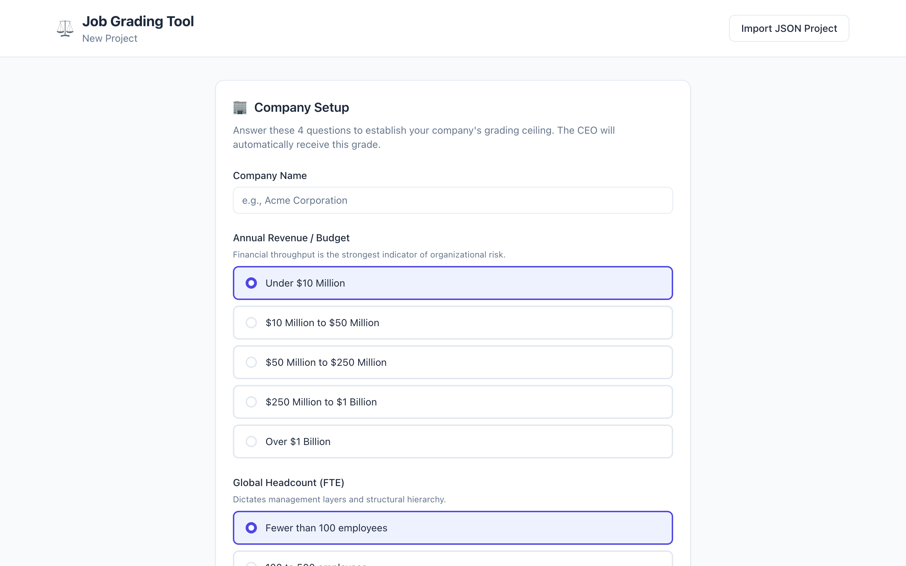
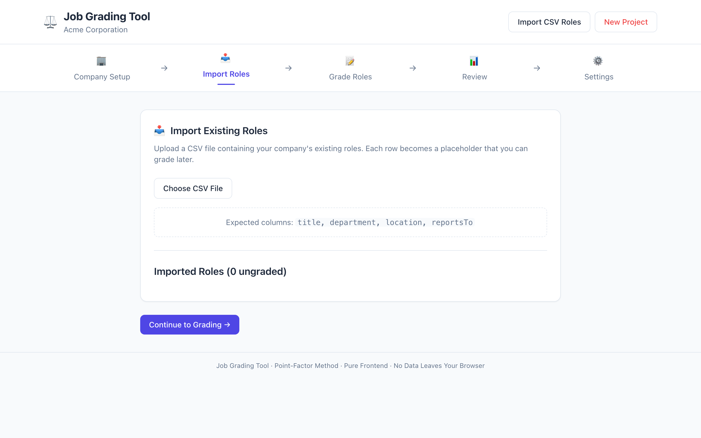
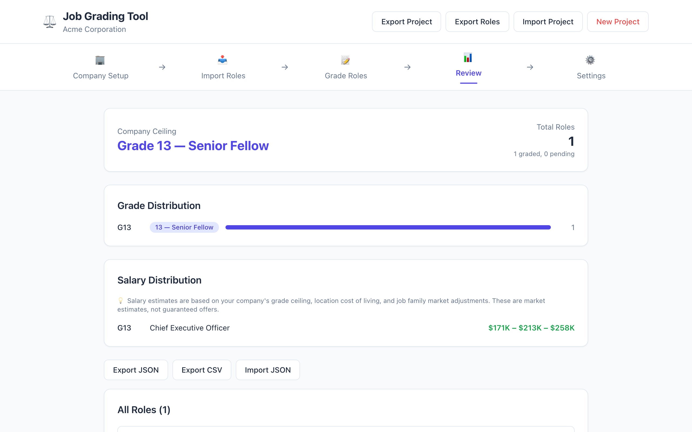
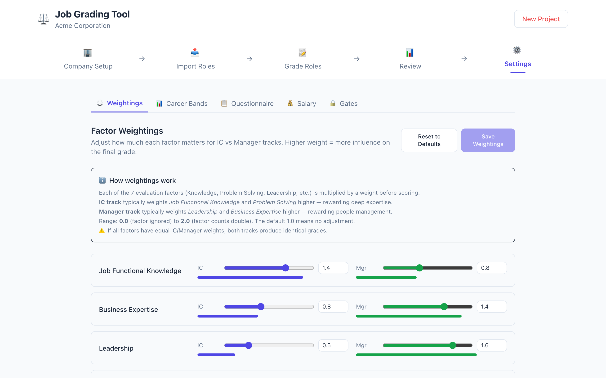
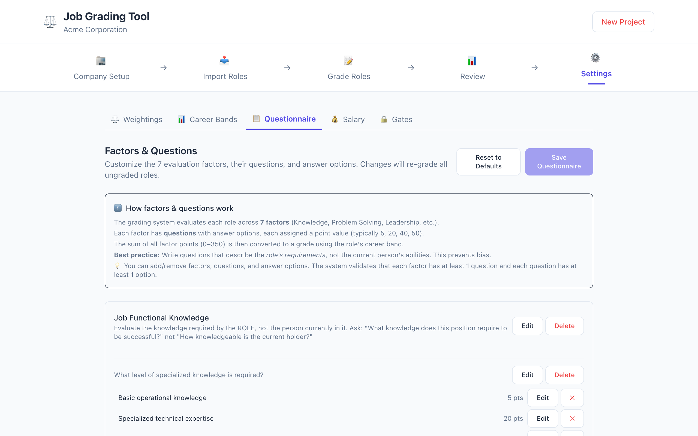
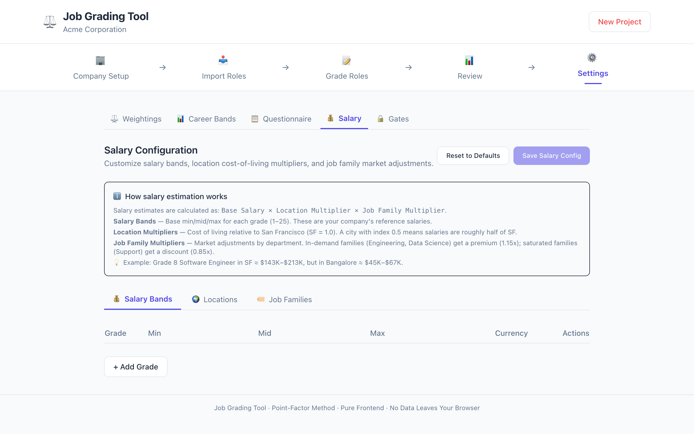
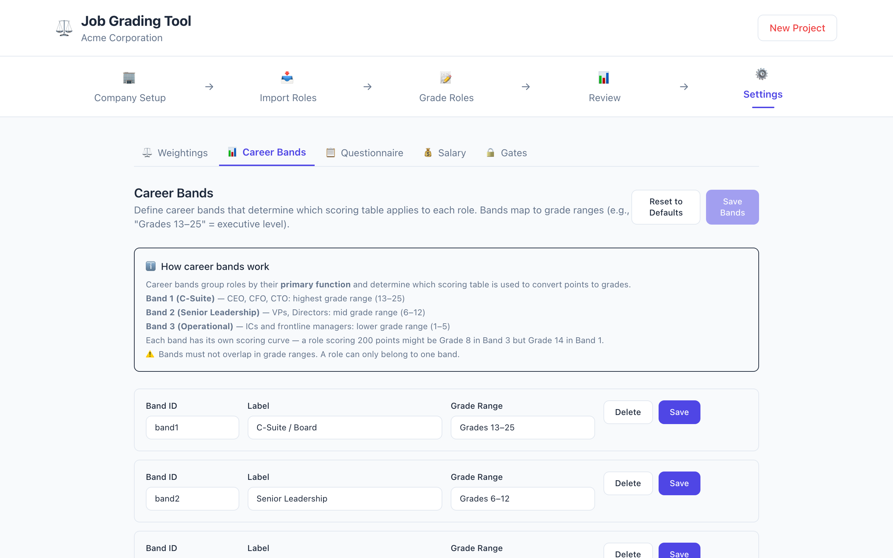
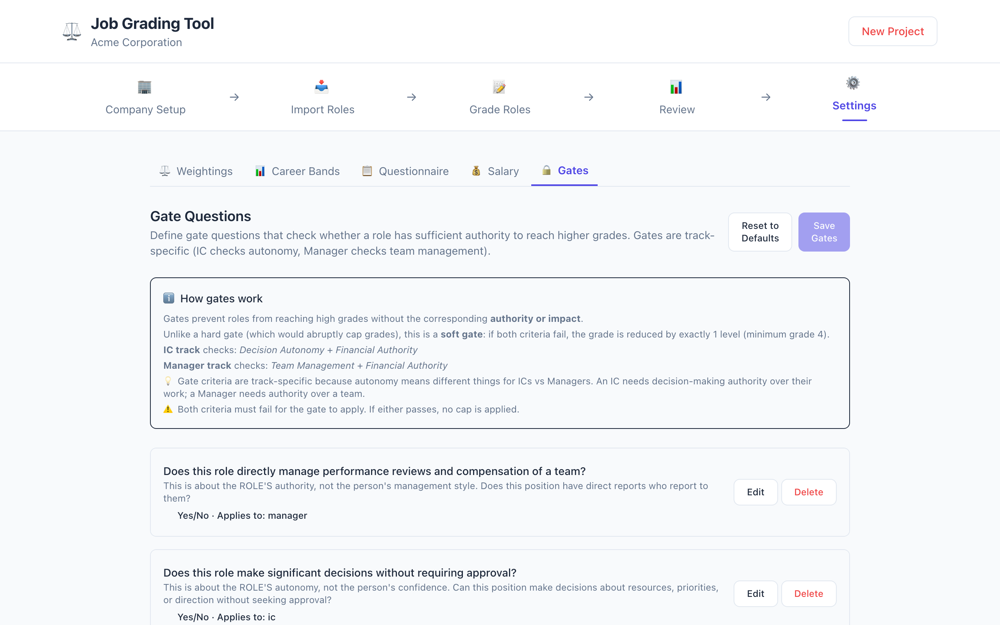

# Job Grader

An internal job role grading tool using the **Point-Factor Method**.

[](https://gabegm.github.io/job-grader/)

## Live Demo

Try it live at [gabegm.github.io/job-grader](https://gabegm.github.io/job-grader/).

## Screenshots

### Company Setup

Set up your company with 4 questions to establish the grading ceiling.



### Company Setup (Filled)

After entering company details, the ceiling grade is calculated and displayed.



### Import Roles

Import existing roles via CSV or add them manually.


### Review Panel

View all graded roles with grade distribution and salary estimates.



### Settings — Factor Weightings

Adjust how much each factor matters for IC vs Manager tracks with visual sliders.



### Settings — Questionnaire

Edit the 7 evaluation factors, their questions, and answer options.



### Settings — Salary

Configure salary bands, location multipliers, and job family market adjustments.



### Settings — Career Bands

Define career bands with custom names and grade ranges.



### Settings — Gate Questions

Define gate questions that check whether a role has sufficient authority to reach higher grades.



## Features

- **Pure frontend** — no backend, no database, no authentication
- **Portable** — state stored in JSON files (import/export)
- **Zero cloud dependency** — runs entirely in the browser, works offline
- **GitHub Pages ready** — deploy as a static site for free
- **Dual career tracks** — Individual Contributor (IC) and Managerial tracks with parallel grade ladders
- **Configurable scoring** — factors, weightings, and bands are data-driven (JSON), not hardcoded
- **Salary integration** — Automatic salary estimation based on grade, location, and job family

## Getting Started

### Prerequisites

- Node.js 18+
- npm or pnpm

### Installation

```bash
npm install
```

### Development

```bash
npm run dev
```

Open [http://localhost:5173](http://localhost:5173) in your browser.

### Build

```bash
npm run build
```

The built output will be in the `dist/` directory.

### Testing

```bash
npm test
```

With coverage:

```bash
npm run test:coverage
```

## Sample Data

Sample datasets are included in the `sample-data/` directory:

- **`sample-roles.csv`** — 16 example roles across departments (Engineering, Sales, Marketing, etc.) and locations (New York, San Francisco, Austin, Chicago)
- **`sample-project.json`** — A complete Acme Corporation grading project with company setup, questionnaire definitions (7 factors + gate questions + factor weightings), grade ceiling, and 16 pre-graded roles with IC/Manager track assignments

Use these as a starting point or reference when exploring the tool.

## Usage

1. **Company Setup** — Enter your company details and revenue bracket
2. **Import Roles** — Add job roles via CSV/JSON import or manual entry
3. **Select Career Track** — Choose IC (Individual Contributor) or Managerial for each role
4. **Grade Roles** — Assign point values across factors (Knowledge, Skills, Impact, etc.)
5. **Review & Compare** — View graded roles, compare positions, and export results

### Career Tracks

The tool supports two parallel career tracks, inspired by Google's Point-Factor Method:

- **Individual Contributor (IC)** — Roles focused on deep expertise and technical/functional impact. Factors like "Job Functional Knowledge" and "Problem Solving" are weighted more heavily. Grade labels: Staff IC, Principal IC, Distinguished IC, Fellow.

- **Managerial** — Roles with people management, budget ownership, and organizational impact. Factors like "Leadership" and "Business Expertise" are weighted more heavily. Grade labels: Team Lead, Manager, Senior Manager, Director, VP.

Both tracks converge at equivalent grades (e.g., Staff IC ≈ Manager, Principal IC ≈ Senior Manager, Distinguished IC ≈ Director), enabling fair comparison across tracks.

### Career Bands

Roles are assigned to one of three career bands, which determine the scoring table used to convert points to grades:

| Band | Label | Grade Range | Description |
|------|-------|-------------|-------------|
| Band 1 | C-Suite / Board | 13–25 | CEO, CFO, CTO, and other C-suite roles |
| Band 2 | Senior Leadership | 6–12 | VPs, Directors, Senior Directors |
| Band 3 | IC & Frontline Managers | 1–5 | Individual Contributors, Engineers, Analysts, Team Leads, Managers |

### Salary Estimation

The tool includes a **Market Pricing Engine** that estimates salary ranges based on:

1. **Global Grade** — The grade assigned by the Point-Factor engine (1–25)
2. **Location** — Cost of living index relative to San Francisco (SF = 1.0)
3. **Job Family** — Market adjustment factor by department (Engineering = 1.15, Support = 0.85)

**Example:** A Grade 8 Software Engineer in San Francisco earns ~$143K–$213K, while the same role in Bangalore earns ~$45K–$67K.

Salary bands are:
- **Configurable** — Upload your own bands or use defaults
- **Location-aware** — Same grade, different city = different salary
- **Family-aware** — Same grade, different department = different salary
- **Currency-agnostic** — Core engine outputs grades, salaries are a separate overlay

## Export & Import

- **Export** — Download your grading project as a JSON file
- **Import** — Load a previously saved JSON project
- **CSV Export** — Export graded roles as CSV for sharing

## Tech Stack

- [Svelte 5](https://svelte.dev/) — UI framework
- [TypeScript](https://www.typescriptlang.org/) — Type safety
- [Vite](https://vite.dev/) — Build tool
- [Tailwind CSS](https://tailwindcss.com/) — Styling
- [Vitest](https://vitest.dev/) — Testing

## License

[MIT](LICENSE) — free to use, modify, and distribute.
